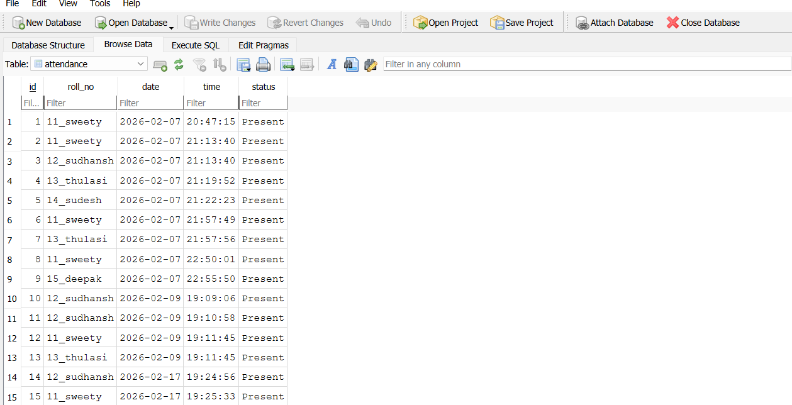
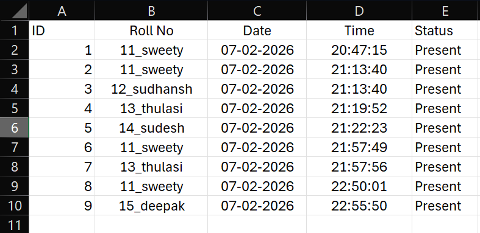

# AI-Based-Face-Recognition-Attendance-System

### Project Overview
This system captures facial images of students, trains a face recognition model, and later recognizes faces using a camera to automatically mark attendance in an SQLite database.


### Project Flow
1.Face Registration – Capture multiple images of a student using a webcam

2.Model Training – Generate and store face encodings

3.Face Recognition – Recognize faces from live video

4.Attendance Marking – Store attendance automatically in SQLite database

5.Data Export – Export attendance records to CSV for easy viewing and reporting


### Tech Stack
- Programming language - python 3.10.10  (Recommended to use Python 3.10.x for compatibility with dlib and face-recognition.)
- AI/Vision - face-recognition, dlib, OpenCV
- Core Libraries- numpy, pandas, imutils, pillow
- Database - SQLite3
- Environment - Python Virtual Environment (venv)


### Steps to Run the Project
step 1: Create & Activate Virtual Environment

```bash```
- python -m venv venv310
- venv310\Scripts\activate 

step 2: Install Required Packages

- opencv-python==4.8.0.76
- numpy==1.24.4
- imutils==0.5.4
- pillow==12.1.0
- face-recognition==1.3.0
- face-recognition-models==0.3.0
- dlib-bin==19.24.6
- pandas==2.3.3
- reportlab==4.4.9

step 3: Capture Student Faces

```bash```
- python -m src.capture_faces (Captures ~30 images per student.)

step 4: Train the Model

```bash```
- python -m src.train_model (Generates face encodings.)

step 5: Recognize Faces & Mark Attendance

```bash```
- python -m src.recognize_faces (Attendance is marked automatically when a face is recognized.)


### View Attendance
1.**SQLite DB**:

-Open database/attendance.db using DB Browser for SQLite

2.**CSV File**:

-Open the exported exports/attendance.csv in Excel or any spreadsheet tool

# Screenshots
### While capturing face


### While taking attendace


### Marked Attendance in Database


### Marked Attendace in CSV file



